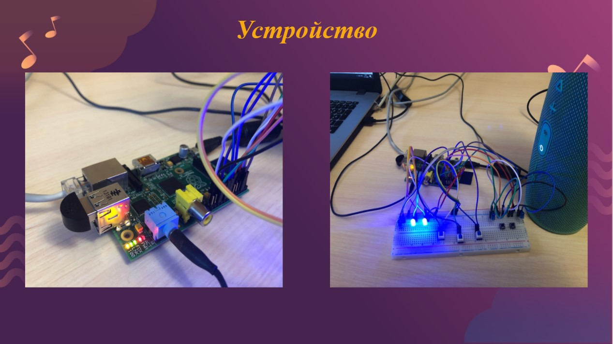

# GPIO-music-box
# Реализация блока аудиоэффектов для голоса и гитары на Python с использованием RaspberryPi.
Выполнено в рамках курсового проекта по "Микропроцессорным системам".
3 курс, СПбПУ Политех.  
Три основные скрипта проекта:
* audio-effects.py - накладывание аудиоэффекта и вывод на динамик
* switches-loops.py - прослушивание кнопок, подключенных к RaspberryPi
* load-share-file.py - синхронизация файла конфигурации состояний(кнопок) на RaspberryPi и на локальном компьютере  

# Raspberry + breadboard with buttons, leds and switches:

